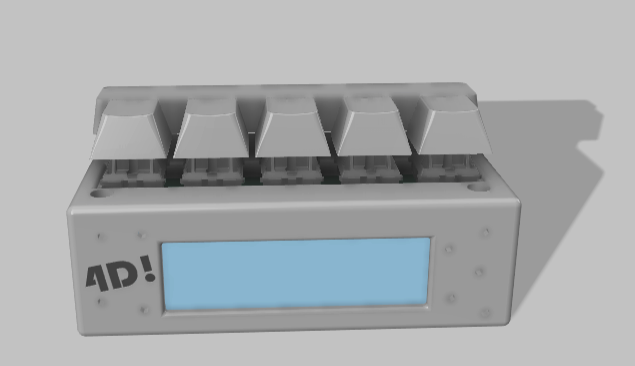
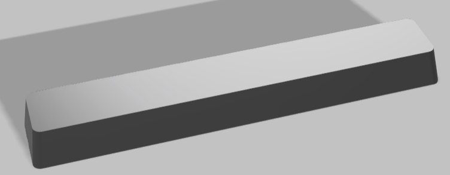
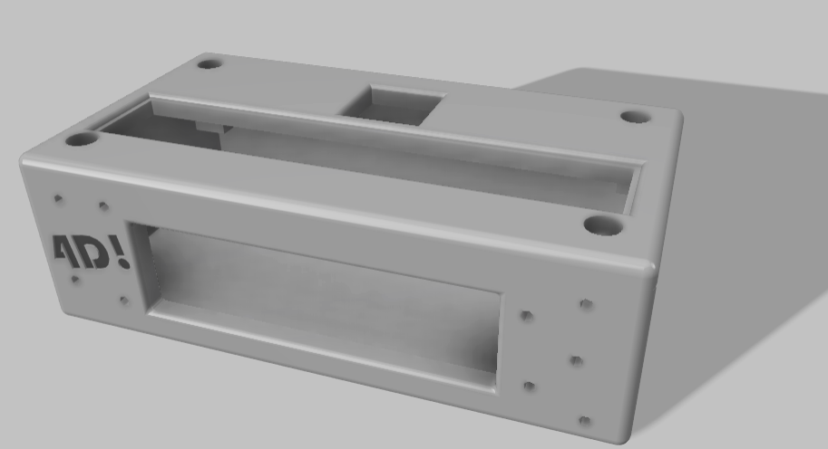
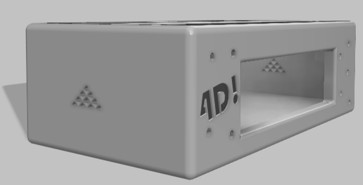

# 4th-Dimension-Tracker
A cool alarm clock, feature packed with minigames to wake you up. Also has Timer and Stopwatch functionality.

  

# PCB
The PCB is designed on Kicad for the following components -  
 - 6 mx style switches 
 - seeduino board 
 - buzzer 
 - TFT display.

It will be mounted with the lid of the case using 4 screws and heatset inserts.

  

# CAD
 - For this project there are 2 things to be 3D printed, a case and a large keycap (Slightly smaller than a usual spacebar on our keyboard)

  

 - The case has hexagonal designs on the front and a text "4D!" which can be printed in a different colour and then stuck into the case. 

  

 - It consists of two parts, the lid and the base, assembled via 4 screws which also support the pcb.

 - On the sides we have triangular holes on the sides for sound to come out.

  

 - There are pillar like blocks inside the case to install the heatset screws.

# Firmware

# Interface & Games

# BOM
From the Blare kit - 
 - 1x Seeed XIAO ESP32C3
 - 6x MX-Style Keyboard Switches
 - 6x White Blank DSA Keycaps
 - 1x 2.25in TFT Screen
 - 1x 3.3V Piezo Buzzer
 - 1x 2.54mm 8 Pin Male Header
 - 8x 20cm Female-Female Jumper Wires
 - 4x M3x5x4 Heatset Inserts
 - 4x M3x8mm Screws

From the grant - 
 - 3D printed case
 - 3D printed keycap
 - PCB

# Next Steps